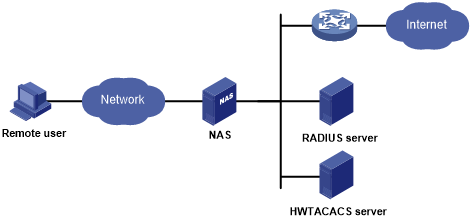

# Ops Reading 41
## Reconnaissance

**1. How are the stages of a pen test very similar to those of the Cyber Kill Chain?**
- Stages of a pen test are very similar to cyber kill chain because they both start off with planning and reconnaissance. Step one is always the target.

**2. Your manager has asked you to explain the benefits of a pentest to the company’s leadership. How would you lead this conversation?**
- I would explain to my manager that the only true way to test our security is by hiring pentesters to come and work on our systems. I would tell my manager to keep it a secret or maybe tell them to hire me to do the test so I can put on my resume that I have pentesting skills.

## Things i wish i knew more of
I wish I knew more of how much a pentester makes and how do I become one

## Resources:
https://www.imperva.com/learn/application-security/penetration-testing/